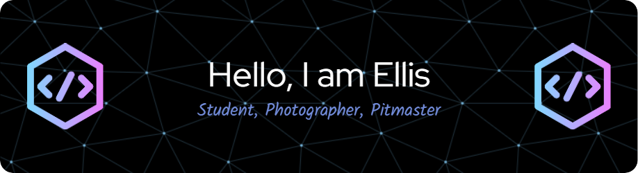

<h1 align="center">Hello, Thank you for reading!</h1>
<p align="center">
  
</p>

---

### 🎯 About Me

 **Student | Developer | Tech Enthusiast | Photographer | Pitmaster**  
🎓 Currently studying IT, planning to major in Computer Engineering  
🧠 Passionate about:
- Embedded systems & hardware
- Programming (Java, C, Python, MIPS Assembly)
- Particle animations & creative coding (Processing)
- Cooking & Grilling
- FPV Drones & Rubiks Cubes

💬 Ask me about:
- Particle physics animations
- Computers and computer technology
- 3D Printing
- BBQ and why vinegar sauce is elite 🔥🍖

---

### 🚀 Current Projects
- 🧪 Building a **user-driven gas price tracking page**
- ⚙️ Designing **particle physics demos in Processing**
- 💾 Playing with **low-level systems & MIPS Assembly**
- 🔄 Merging creative visuals with interactive controls

---

### 🛠️ Tech Stack

```plaintext
Languages:   Java • C • Python • MIPS Assembly • HTML/CSS/JS
Tools/Tech:  Processing • Git • VSCode • Firebase • GitHub Actions
```

---

### 📫 My Contact info:

📍 **Location:** Pittsburgh, PA (USA)  
📧 **Email:** simmons.ellis@gmail.com  
🌐 **Portfolio:** [(https://esimmons1.github.io))

> 💡 _"Coding, crashing, learning. Whether it's drones, code, 3d printers, or computers, the rebuild's half the fun."_

<p align="center">
  
</p>

---

<p align="center">
  
</p>
